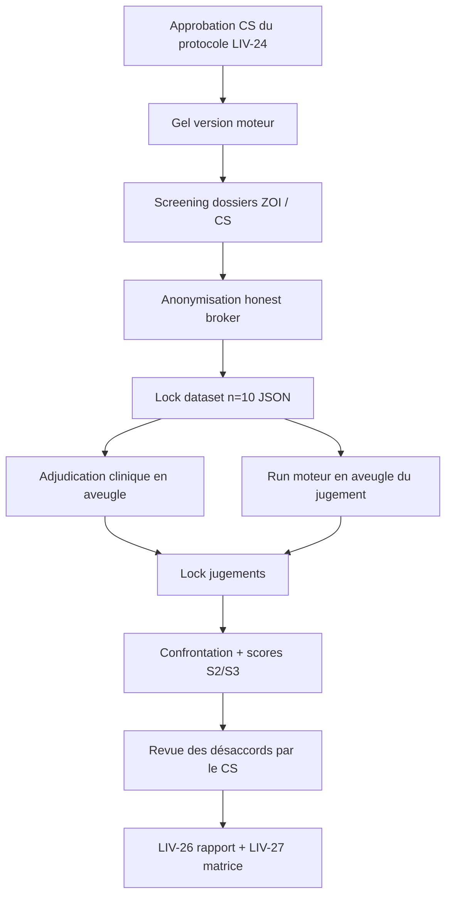

# Protocole de validation clinique — 10 cas ZOI (LIV-24)

> **Document** : LIV-24 — Document contrôlé
> **Version** : 0.1
> **Statut** : **Brouillon — en attente d'approbation du Comité Scientifique (CS)**
> **Date** : 6 septembre 2026
> **Périmètre** : Phase 1 — J63-J92 (`docs/PHASE1_ROADMAP.md`)
> **Classification** : Interne. Aucune donnée patient, aucun PHI.
> **Destination** : revue et signature CS avant toute extraction de cas réels (LIV-25)

| Champ | Valeur |
|-------|--------|
| Titre court | Concordance classifier vs jugement clinicien — n=10 |
| Type d'étude | Rétrospective, observationnelle, non interventionnelle |
| Produit évalué | Functional Chef — moteur d'aide à la décision (classifier + leviers + filtres sécurité) |
| Population source | Patients ZOI Analyse Patient et/ou patients des membres du CS |
| Taille d'échantillon | n=10 cas anonymisés (cible de stratification ci-dessous) |
| Critère principal | Concordance du bottleneck dominant (moteur vs clinicien adjudicateur) |
| Usage réglementaire | **Hors investigation clinique MDR Art. 62.** Preuve interne de crédibilité scientifique. Pas une étude de performance destinée à un marquage CE. |

---

## Table des matières

1. [Contrôle documentaire](#1-contrôle-documentaire)
2. [Objectifs](#2-objectifs)
3. [Périmètre et hors-périmètre](#3-périmètre-et-hors-périmètre)
4. [Distinction jeux synthétiques / jeu clinique](#4-distinction-jeux-synthétiques--jeu-clinique)
5. [Population](#5-population)
6. [Critères d'inclusion et d'exclusion](#6-critères-dinclusion-et-dexclusion)
7. [Taille d'échantillon et stratification](#7-taille-déchantillon-et-stratification)
8. [Données à capturer](#8-données-à-capturer)
9. [Anonymisation et interdiction de PHI](#9-anonymisation-et-interdiction-de-phi)
10. [Critères de jugement](#10-critères-de-jugement)
11. [Méthode et procédure](#11-méthode-et-procédure)
12. [Rôles et responsabilités](#12-rôles-et-responsabilités)
13. [Plan d'analyse (LIV-26 / LIV-27)](#13-plan-danalyse-liv-26--liv-27)
14. [Critères de succès](#14-critères-de-succès)
15. [Éthique, RGPD et disclaimer](#15-éthique-rgpd-et-disclaimer)
16. [Gestion des écarts et amendements](#16-gestion-des-écarts-et-amendements)
17. [Livrables liés](#17-livrables-liés)
18. [Annexes](#18-annexes)

---

## 1. Contrôle documentaire

### 1.1 Historique des versions

| Version | Date | Auteur | Nature | Statut |
|---------|------|--------|--------|--------|
| 0.1 | 2026-09-06 | Équipe produit (rédaction initiale) | Création — critères, endpoints, méthode | Brouillon, soumis au CS |

Toute évolution incrémente le numéro de version mineure (revue rédactionnelle) ou majeure (changement d'endpoints, de population ou de méthode). Un amendement majeur requiert une nouvelle approbation CS avant reprise de l'extraction.

### 1.2 Circuit d'approbation

| Étape | Acteur | Action | Preuve |
|-------|--------|--------|--------|
| 1 | Rédacteur | Diffuse le brouillon v0.1 | Présent document dans le repo |
| 2 | CS (≥2 membres, LIV-18 / LIV-20) | Revue scientifique : population, endpoints, méthode, éthique | Commentaires écrits |
| 3 | CS | Approbation ou demande de modification | Signatures §1.3 |
| 4 | Investigateur | Gel du protocole (version approuvée taguée) | Tag git `liv-24-vX.Y` + PDF archivé |

**Règle** : aucun cas réel (LIV-25) n'est extrait, saisi ou soumis au moteur tant que le CS n'a pas approuvé une version de ce protocole.

### 1.3 Page de signatures (à compléter après revue)

| Rôle | Nom | Date | Décision | Signature / paraphe |
|------|-----|------|----------|---------------------|
| Membre CS — nutrition / médecine fonctionnelle | | | Approuvé / Approuvé sous réserve / Refusé | |
| Membre CS — métabolisme / recherche | | | Approuvé / Approuvé sous réserve / Refusé | |
| Investigateur coordinateur | | | Prise d'acte | |
| Référent technique moteur | | | Prise d'acte (gel de version) | |

Réserves éventuelles (texte libre, pas de données patient) :

> _À renseigner par le CS._

---

## 2. Objectifs

### 2.1 Objectif principal

Estimer, sur **10 dossiers cliniques réels anonymisés**, la **concordance** entre :

- le **bottleneck dominant** produit par le classifier déterministe Functional Chef (`bottleneck-classifier.ts`, règles de `docs/BOTTLENECK_SPEC.md`) ;
- le **bottleneck dominant** porté par un clinicien adjudicateur, en aveugle de la sortie moteur.

Le clinicien est la **référence de jugement** pour cette étude (gold standard opérationnel). Il ne s'agit pas d'une vérité physiopathologique indépendante.

### 2.2 Objectifs secondaires

1. Décrire la concordance du **co-dominant** (présent / absent / identité).
2. Évaluer la **pertinence clinique des leviers** sélectionnés pour le bottleneck dominant (et co-dominant le cas échéant).
3. Évaluer le **caractère approprié des filtres de sécurité** (exclusions, warnings, ingrédients interdits) au regard des conditions et allergies documentées.
4. Documenter les **désaccords** (type, gravité, cause probable : données manquantes, seuil, cascade de priorité, subjectivité des signaux DYSBIOSE).
5. Produire les artefacts **LIV-26** (rapport cas par cas) et **LIV-27** (matrice de concordance), sans prétendre à une estimation fréquentielle généralisable.

### 2.3 Objectifs non poursuivis

Ce protocole **ne vise pas** à :

- démontrer un bénéfice clinique patient (pas de suivi, pas d'intervention) ;
- valider les tiers EBM des leviers (couvert par LIV-21 à LIV-23) ;
- remplacer les tests de non-régression synthétiques (LIV-39 à LIV-41) ;
- servir de dossier de performance clinique pour un organisme notifié, sauf amendement ultérieur (ISO 14155 / MDCG 2020-1) explicitement décidé par le CS et le référent MDR.

---

## 3. Périmètre et hors-périmètre

### 3.1 Périmètre

| Composant moteur | Inclus ? | Commentaire |
|------------------|----------|-------------|
| Classification des 3 bottlenecks pilotes (IR, INFLAM, DYSBIOSE) | Oui | Endpoint principal |
| Phénotypes d'enrichissement (`hepatic_masld`, `pcos_adipose`, etc.) | Oui, secondaire | Tag moteur vs mention clinicien si l'imagerie / le contexte est disponible |
| Filtres de sécurité (`safety-filters.ts`) | Oui | Endpoint secondaire |
| Sélection des leviers (`lever-selector.ts`) | Oui | Pertinence, pas l'efficacité clinique du levier |
| Composition de plat (LLM) | Hors endpoint formel | Sortie optionnelle pour illustration ; non scoré comme critère de succès (variabilité LLM) |
| Dashboard praticien, PDF, auth, RLS | Non | Hors LIV-24 |

### 3.2 Destination d'usage rappelée

Functional Chef est un **outil d'aide à la décision** destiné à un professionnel de santé. Le praticien reste responsable de la prescription. La classification n'est **pas un diagnostic** au sens d'une nomenclature CIM / SNOMED, et la sortie culinaire n'est **pas un traitement** au sens d'une AMM.

Population d'usage visée (spec v0.1) : adultes en **zone fonctionnelle** — notamment IR en zone HOMA-IR 1,5–2,5, inflammaging à CRP-us persistante 1–3 mg/L, dysbiose clinique chronique — et non les tableaux aigus décompensés.

### 3.3 Version moteur gelée

Avant le premier run clinique :

| Élément | Enregistrement obligatoire |
|---------|----------------------------|
| Commit git | SHA complet |
| Version classifier / seeds de seuils | Identifiant ou hash des `biomarker_thresholds` |
| Catalogue leviers | Version seed `culinary_levers` + `lever_bottleneck_map` |
| Règles HARD_RULES | Fichier `safety-filters.ts` (SHA) |
| Environnement | Node, OS, date/heure UTC du run |

Aucun changement de règle, de seuil ou de mapping n'est autorisé entre le premier et le dernier cas du set n=10. Un correctif urgent (bug de sécurité) impose un **re-run complet** et une note d'écart.

---

## 4. Distinction jeux synthétiques / jeu clinique

Deux corpus existent. Ils ne doivent **jamais** être fusionnés dans LIV-26 / LIV-27.

| Corpus | Localisation | Nature | Finalité | Compte pour LIV-25 ? |
|--------|--------------|--------|----------|----------------------|
| Cas-pivot A / B / C | `docs/BOTTLENECK_SPEC.md`, préchargés UI | **Synthétiques** (profils types) | Démo + vérification manuelle | Non |
| Profils de régression (~30) | `src/lib/reasoning/__tests__/patient-profiles.ts` | **Synthétiques** | Tests unitaires (LIV-39, `clinical-validation.test.ts`) | Non |
| Cas offline script | `scripts/test-validation-cases.ts` | **Synthétiques** | Smoke test `npm run test:cases` | Non |
| Seuils / fixtures classifier | `__tests__/bottleneck-classifier.test.ts`, `safety-filters.test.ts`, `lever-selector.test.ts` | **Synthétiques** | Non-régression CI | Non |
| **Set de validation clinique n=10** | Livrable LIV-25 — [`docs/validation/liv25/`](validation/liv25/) (json + PDF anonymisés) | **Cas réels** ZOI / CS | Concordance clinicien (ce protocole) | **Oui** |

**Règles de séparation :**

1. Les identifiants du set clinique suivent le préfixe `ZOI-VAL-01` … `ZOI-VAL-10` (ou `CS-VAL-xx` si source CS exclusive). Ils n'utilisent jamais les ids `A1`, `B2`, `E6`, « Cas A/B/C ».
2. Un résultat de test Vitest **ne peut pas** être cité comme concordance clinique.
3. LIV-26 doit ouvrir par un encadré rappelant que les fixtures synthétiques sont exclues du numérateur et du dénominateur.
4. Si un cas réel ressemble à un cas-pivot, cela n'autorise pas à réutiliser les valeurs du fixture ; seules les valeurs du dossier source (anonymisées) sont saisies.

---

## 5. Population

### 5.1 Population source

Adultes pris en charge dans :

- le réseau **ZOI Analyse Patient** (pilot français Phase 1), et/ou
- la patientèle des **membres du Comité Scientifique**,

pour lesquels un dossier comporte déjà des biomarqueurs et/ou signaux cliniques exploitables au regard de `docs/BOTTLENECK_SPEC.md`.

### 5.2 Population cible (zone fonctionnelle)

La sélection privilégie des dossiers **compatibles avec l'usage prévu** du moteur, et non des tableaux d'urgence ou de maladie décompensée :

| Bottleneck | Zone d'intérêt clinique (rappel spec) |
|------------|----------------------------------------|
| IR | Insulinorésistance fonctionnelle, typiquement HOMA-IR 1,5–2,5, avant critère diabétique franc |
| INFLAM | Inflammation chronique de bas grade, CRP-us persistante en zone 1–3 mg/L, hors infection aiguë |
| DYSBIOSE | Signaux digestifs chroniques (≥3 mois) ± biomarqueur objectif (calprotectine, SIBO, diversité) |

Un dossier peut être **mixte** (deux bottlenecks déclenchés). C'est souhaitable (voir stratification).

### 5.3 Unité d'analyse

Un **cas** = un dossier à une date index T0 (bilan le plus complet, ≤ fenêtre d'ancienneté). Pas de suivi longitudinal dans LIV-24. Si plusieurs bilans existent, l'investigateur retient **un seul** T0, justifié dans la fiche (sans date civile — voir §9).

---

## 6. Critères d'inclusion et d'exclusion

### 6.1 Inclusion (tous requis)

1. Âge **≥ 18 ans** à T0.
2. Dossier issu de ZOI Analyse Patient **ou** d'une patientèle CS, avec base légale de réutilisation (§15).
3. Données suffisantes pour qu'un clinicien puisse porter un jugement de bottleneck dominant, selon le **socle minimal** :

   | Si le dossier est candidat… | Socle minimal |
   |-----------------------------|---------------|
   | IR | HOMA-IR **ou** (insulinémie à jeun **et** glycémie à jeun), **plus** ≥1 marqueur parmi TG/HDL, HbA1c, tour de taille/taille, triglycérides, ALT |
   | INFLAM | CRP-us **et** ≥1 marqueur secondaire (Omega-3 Index, AA/EPA, NLR, ferritine, fibrinogène, IL-6, albumine, HDL) **ou** mention clinique d'inflammation de bas grade persistante documentée par ≥2 dosages CRP |
   | DYSBIOSE | ≥2 signaux parmi Bristol, ballonnements, calprotectine, test SIBO, histoire d'antibiotiques / IPP, apport fibres / diversité végétale |

   Un cas **co-dominant** doit satisfaire le socle de **chaque** bottleneck invoqué par le clinicien.
4. Biomarqueurs de T0 datés dans les **6 mois** précédant l'extraction (cible opérationnelle : **3 mois**, alignée sur `docs/GUIDE_UTILISATION.md`). Un dépassement 3–6 mois est acceptable s'il est noté comme limitation sur la fiche.
5. Sexe renseigné (nécessaire à l'interprétation de certains seuils / phénotypes).
6. Anonymisation réalisable sans perte du socle minimal (§9).

### 6.2 Exclusion

**Exclusion d'emblée (non éligible) :**

| # | Critère | Justification |
|---|---------|---------------|
| E1 | Âge < 18 ans | Usage adulte uniquement (risque R-09 du dossier MDR) |
| E2 | Absence de base légale / consentement secondaire / refus | RGPD Art. 9 |
| E3 | Socle minimal introuvable après revue du dossier | Jugement clinicien non fiable |
| E4 | Identifiants ou récit clinique non anonymisables (maladie très rare + lieu + âge exact, note narrative irréductible) | Risque de ré-identification |
| E5 | Infection aiguë, syndrome inflammatoire aigu, ou CRP-us **> 10 mg/L** à T0 sans cause chronique documentée | Confond INFLAM |
| E6 | Diabète de type 1 ou insulinothérapie intensive hors usage prévu | Hors zone fonctionnelle IR |
| E7 | Grossesse ou allaitement en cours à T0 | Population non couverte par les tests ; filtres spécifiques hors set principal |
| E8 | Chimiothérapie active à T0 | Hors usage ; discussion oncologique requise |
| E9 | Dossier déjà inclus (doublon patient, même si T0 différent) | Indépendance des cas |
| E10 | Cas construit ou semi-synthétique (enseignement, démo, fixture) | Contamination du set clinique |

**Exclusion du jugement DYSBIOSE (le cas peut rester inclus pour IR / INFLAM) :**

| # | Critère | Conduite |
|---|---------|----------|
| E11 | MICI en poussée documentée, calprotectine très élevée dans un contexte de maladie inflammatoire connue | Ne pas coder DYSBIOSE comme dominant « fonctionnel ». Le cas peut servir d'**épreuve de filtre sécurité** (`MICI_active`) si le socle IR ou INFLAM est présent |

### 6.3 Épreuve de sécurité (sous-ensemble)

Parmi les 10 cas, **au moins 1** doit porter ≥1 exclusion médicale **ou** allergie listée dans `safety-filters.ts` (ex. `anticoagulants_high_dose` / AVK, `SIBO_active`, `celiac_disease`, allergie fruits à coque), **sans** tomber sous E7/E8. Objectif : juger l'appropriation des HARD_RULES, pas la classification DYSBIOSE d'une MICI active isolée.

---

## 7. Taille d'échantillon et stratification

### 7.1 n=10 — nature statistique

n=10 est un **effectif de faisabilité** fixé par la roadmap Phase 1 (LIV-25). Il **n'est pas dimensionné** pour une puissance fréquentielle, un intervalle de confiance étroit, ni une publication d'accuracy. Les indicateurs (sensibilité, spécificité, VPP, VPN, kappa) sont **descriptifs**. Un intervalle de Wilson pourra être calculé à titre indicatif ; il sera large et devra être présenté comme tel dans LIV-27.

Le seuil de concordance **> 80 %** mentionné dans `docs/MDR_DOSSIER.md` §6.2 est repris ici comme **cible directionnelle interne**, non comme preuve de performance MDR.

### 7.2 Cible de stratification (jugement clinicien, avant run moteur)

| Strate | Cible | Souplesse |
|--------|-------|-----------|
| Dominant IR | ≥ 3 cas | Obligatoire |
| Dominant INFLAM | ≥ 3 cas | Obligatoire |
| Dominant DYSBIOSE | ≥ 3 cas | Obligatoire |
| Co-dominance (2 bottlenecks déclenchés selon le clinicien) | ≥ 1 cas | Obligatoire |
| Aucun bottleneck dominant (profil incomplet ou zone franche) | 0 ou 1 cas | Optionnel — utile pour tester le comportement conservateur |
| Phénotype `hepatic_masld` (imagerie PDFF ≥5 % ou MRS >5,56 %) | ≥ 1 si disponible | Souhaitable, non bloquant |
| Épreuve de sécurité (§6.3) | ≥ 1 cas | Obligatoire |
| Mixte femmes / hommes | ≥ 3 de chaque sexe si le vivier le permet | Souhaitable |
| Tranches d'âge | Au moins 2 des 3 bandes 18–39 / 40–59 / ≥60 | Souhaitable |

La 10ᵉ place sert à équilibrer les strates ou à accueillir un cas limite / co-dominant / sécurité.

**Ordre de remplissage recommandé :** d'abord les 3 dominants × 3, puis le cas co-dominant et/ou sécurité (ils peuvent se recouper : un cas IR+INFLAM sous AVK compte pour IR, co-dominant et sécurité).

Si le vivier ZOI/CS ne permet pas d'atteindre une strate obligatoire après screening exhaustif, l'investigateur consigne un **écart** et le CS décide : clôturer à n<10, élargir la source, ou assouplir une strate. On ne « complète » **pas** avec un fixture synthétique.

### 7.3 Screening log (sans PHI)

Un registre de screening (fichier séparé, accès restreint) compte : nombre de dossiers examinés, inclus, exclus par motif E1–E11, strate provisoire. Aucun nom, aucun identifiant source.

---

## 8. Données à capturer

Toutes les valeurs sont saisies dans un **JSON conforme** au `PatientProfile` applicatif (`src/lib/reasoning/types.ts`), plus des métadonnées d'étude. Aucun champ libre identifiant.

### 8.1 Métadonnées de cas (étude)

| Champ | Format | Règle |
|-------|--------|-------|
| `case_id` | `ZOI-VAL-01` … | Attribué après anonymisation |
| `source_pool` | `ZOI` / `CS` / `ZOI_CS` | Pas le nom du cabinet |
| `engine_git_sha` | hex | Rempli au run, pas à l'extraction |
| `protocol_version` | `0.1` | Version LIV-24 gelée |
| `t0_offset_days` | entier | Jours entre un ancrage interne et T0 — **pas de date civile** dans le json livrable |
| `data_completeness` | `IR` / `INFLAM` / `DYSBIOSE` flags | Quels socles sont satisfaits |
| `age_band` | `18-29` / `30-39` / `40-49` / `50-59` / `60-69` / `70+` | Préférer la bande à l'âge exact si risque de ré-identification |
| `sex` | `F` / `M` | Requis |

L'âge exact **peut** être conservé dans le json moteur si la combinaison âge × sexe × strate n'est pas unique et rare ; sinon `age_band` seulement et `age` omis.

### 8.2 Biomarqueurs (clés `biomarker_values`)

Saisir uniquement les valeurs **disponibles**. Ne pas imputer. Unités = celles de la spec.

**IR**

| Clé | Unité attendue | Poids spec |
|-----|----------------|------------|
| `HOMA_IR` | index | Majeur |
| `FASTING_INSULIN` | µU/mL | Majeur |
| `HBA1C` | % | Majeur |
| `TG_HDL_RATIO` | ratio | Majeur |
| `FASTING_GLUCOSE` | g/L | Modéré |
| `TRIGLYCERIDES` | g/L | Modéré |
| `ALT` | U/L | Modéré |
| `URIC_ACID` | mg/dL | Mineur |
| `WAIST_HEIGHT_RATIO` | ratio | Modéré |
| `APO_B` | g/L | Modéré |
| `CGM_SD` | mg/dL | Discriminant (rare) |
| `LIVER_FAT_PDFF` | % | Majeur MASLD (imagerie) |
| `LIVER_FAT_MRS` | % | Majeur MASLD (imagerie) |
| `GGT` | U/L | Modéré (implémentation v0.2) |
| `SHBG` | nmol/L | Modéré (phénotype) |
| `A_HYDROXYBUTYRATE` | µmol/L | Discriminant si dispo |

**INFLAM**

| Clé | Unité attendue | Poids spec |
|-----|----------------|------------|
| `CRP_US` | mg/L | Majeur |
| `OMEGA3_INDEX` | % | Majeur |
| `AA_EPA_RATIO` | ratio | Majeur |
| `IL6` | pg/mL | Majeur (si dispo) |
| `NLR` | ratio | Modéré |
| `FERRITIN` / `FERRITIN_HIGH` | µg/L | Modéré — noter TSAT si connu |
| `TSAT` | % | Contexte fer |
| `ALBUMIN` | g/L | Modéré |
| `FIBRINOGEN` | g/L | Modéré |
| `HOMOCYSTEINE` | µmol/L | Modéré (v0.2) |
| `DEXA_VAT` | cm² | Discriminant (si dispo) |

**Signaux alimentaires parfois portés comme cliniques / IR-MASLD**

| Clé | Unité | Commentaire |
|-----|-------|-------------|
| `FRUCTOSE_INTAKE` | g/j | Estimation clinicien, pas un labo |
| `FREE_SUGAR_PCT_ENERGY` | % AET | Idem |

### 8.3 Signaux cliniques (`clinical_signals`)

| Clé | Type | Commentaire |
|-----|------|-------------|
| `BRISTOL_SCORE` | 1–7 | Habituel / chronique, pas un épisode isolé |
| `BLOATING_FREQ` | numérique (échelle moteur) | Fréquence habituelle |
| `CALPROTECTIN` | µg/g | Peut vivre en biomarqueur selon saisie |
| `SIBO_BREATH_TEST` | catégoriel (`positif` / `negatif`) | |
| `ABX_LIFETIME` | entier | Cures déclarées ; incertitude à noter |
| `FIBER_INTAKE` | g/j | Estimation |
| `PLANT_DIVERSITY` | plantes/sem | Estimation |
| `PPI_CHRONIC` | flag / durée | >6 mois si connu |
| `SHANNON_DIVERSITY` | index | Si métagénomique dispo |

### 8.4 Soft signals, exclusions, contexte

- `soft_signals` : flags booléens du type (`fatigue_postprandiale`, `fringales_glucidiques`, `sopk_connu`, etc.) — **sans texte libre**.
- `exclusions.medical` : codes canoniques du moteur uniquement (`MICI_active`, `AVK`, `anticoagulants_high_dose`, `SIBO_active`, `celiac_disease`, `IBS_severe`, `gallstones_active`, `hemochromatosis`, `oxalate_stones`, `severe_hypothyroidism`, …).
- `exclusions.allergies` : codes (`nuts`, `peanuts`, `gluten`, `shellfish`, `fish`, `eggs`, `milk`, `soy`, `sesame`).
- `exclusions.dietary_pattern` : `vegetarian` / `vegan` / `pescatarian` / `halal` / `kosher` le cas échéant.
- `context` : préférences culinaires génériques, **sans** nom de restaurant, ville, ou habitude unique.

**Interdit** : antécédents narratifs, comptes-rendus, listes de médicaments en clair (utiliser les flags `medication_*` existants), profession, code postal, initiales.

### 8.5 Jugement clinicien (recueilli **avant** ouverture de la sortie moteur)

| Champ | Valeurs |
|-------|---------|
| `clinician_dominant` | `IR` / `INFLAM` / `DYSBIOSE` / `none` |
| `clinician_co_dominant` | idem ou `null` |
| `clinician_phenotypes` | liste courte (`hepatic_masld`, `pcos_adipose`, …) ou vide |
| `clinician_confidence` | `haute` / `moyenne` / `basse` |
| `clinician_rationale_codes` | codes de critères (ex. `HOMA_IR`, `CRP_US`, `BRISTOL_SCORE`) — **pas de prose identifiant** |
| `safety_conditions_expected` | codes exclusions que le clinicien juge devoir déclencher un filtre ou un warning |

### 8.6 Sortie moteur (après gel et run)

Enregistrer tel quel : `dominant`, `co_dominant`, scores par bottleneck, `triggered`, `phenotypes`, liste des leviers (`id`, `role`, `tier`), leviers exclus + raison, `warnings`, `forbidden_ingredients`.

### 8.7 Scores secondaires (après confrontation)

Voir §10.2. Saisis par l'adjudicateur **après** révélation de la sortie leviers/sécurité, **sans** modifier le jugement de bottleneck déjà verrouillé.

---

## 9. Anonymisation et interdiction de PHI

### 9.1 Principe

Le livrable LIV-25 et tout fichier versé au repo, au CS ou à un outil d'analyse **ne contient aucune PHI**. On vise une **anonymisation de fait** pour le jeu livrable (irréversibilité raisonnable). La table de correspondance cas ↔ dossier source, si elle existe, reste chez l'investigateur / le prestataire ZOI, hors repo, hors cloud produit Functional Chef.

### 9.2 Identifiants et attributs interdits

| Catégorie | Exemples interdits | Traitement |
|-----------|-------------------|------------|
| Identité | Nom, prénom, initiales, signature, photo | Suppression |
| Contact | Adresse, téléphone, email, réseaux | Suppression |
| Identifiants | NIR, N° sécu, IPP, N° dossier ZOI brut, RPPS du patient (n/a), n° labo | Remplacement par `case_id` d'étude |
| Dates civiles | Date de naissance, date de bilan, date de RDV | Âge en bande ; T0 relatif |
| Localisation | Code postal, ville, établissement nommé | `source_pool` seulement |
| Récit | Compte-rendu, motif de consultation libre, profession, événements de vie | Non exportés |
| Médias | Photos d'ordonnance, captures d'écran nominatives | Interdits |
| Quasi-identifiants rares | Maladie orpheline + âge + sexe | Exclusion E4 |

Les **valeurs biologiques** nécessaires à la classification sont conservées (ce sont des données de santé : elles ne circulent que dans le canal contrôlé LIV-25, pas dans des tickets publics).

### 9.3 Procédure d'anonymisation (honest broker)

```
Dossier source (ZOI / CS)
        │
        ▼
  Honest broker (investigateur ou référent ZOI habilité)
        │  retire PHI, attribue case_id, vérifie E4
        ▼
  Fiche JSON LIV-25 (sans clé de ré-identification)
        │
        ├─► Adjudicateur (jugement bottleneck, aveugle moteur)
        └─► Opérateur technique (run moteur, aveugle jugement jusqu'au lock)
```

L'honest broker **ne participe pas** à l'adjudication clinique du même cas.

### 9.4 Contrôle avant commit / partage

Checklist obligatoire (l'investigateur paraphe) :

- [ ] Aucun nom, email, téléphone, adresse
- [ ] Aucune date civile
- [ ] Aucun identifiant source
- [ ] Aucune note libre
- [ ] `case_id` au format étude
- [ ] Recherche plein-texte des motifs `[A-Z][a-z]+ [A-Z][a-z]+` (noms propres) sur le json/PDF
- [ ] Le fichier n'est poussé sur git **qu'après** cette checklist

### 9.5 Conservation

| Artefact | Lieu | Durée indicative |
|----------|------|------------------|
| Table de correspondance | Hors repo, accès investigateur / ZOI | Jusqu'à clôture LIV-26 + 12 mois, puis destruction |
| JSON / PDF LIV-25 anonymisés | Canal CS +, si validé, repo interne | Selon politique projet (cible 3 ans pour traces d'étude) |
| Sorties moteur + scores | Idem LIV-26 | Idem |
| Screening log agrégé | Repo ou archive qualité | Durée du dossier Phase 1 |

---

## 10. Critères de jugement

### 10.1 Critère principal — concordance du dominant

**Définition.** Accord exact sur le bottleneck dominant :

`engine.dominant == clinician.dominant`

où chaque côté ∈ {`IR`, `INFLAM`, `DYSBIOSE`, `none`}.

- `none` : aucun bottleneck dominant (profil insuffisant ou non déclenché).
- La **cascade de priorité moteur** IR > INFLAM > DYSBIOSE en triple déclenchement est un **postulat de design** (`docs/BOTTLENECK_EVALUATION.md`), pas une règle clinique validée. En cas de triple tableau, le clinicien code son dominant selon son jugement ; un désaccord de cascade est classé `DISC-CASCADE` (§13.3).

**Indicateur principal :** proportion de cas concordants / 10 (ou / n analysable).

**Règle d'analysabilité :** un cas est analysable pour le critère principal si le jugement clinicien est verrouillé et le run moteur s'est terminé sans erreur. Pas d'exclusion post-hoc pour « désaccord ».

### 10.2 Critères secondaires

| # | Critère | Mesure | Fenêtre |
|---|---------|--------|---------|
| S1 | Concordance du co-dominant | Accord sur présence/absence **et**, s'il est présent des deux côtés, sur l'identité | Jugement verrouillé vs moteur |
| S2 | Pertinence des leviers | Pour chaque levier retenu : `pertinent` / `discutable` / `non pertinent` / `non évaluable`. Synthèse cas : % `pertinent` parmi les évaluables | Après révélation de la liste leviers |
| S3 | Appropriation des filtres sécurité | Pour chaque condition/allergie documentée : le filtre ou warning attendu est-il présent ? (`TP` / `FN`). Pour chaque warning moteur : est-il justifié ? (`TP` / `FP`) | Après révélation safety |
| S4 | Phénotypes | Accord sur `hepatic_masld` si imagerie présente ; autres tags en descriptif | — |
| S5 | Complétude d'entrée | Nombre de biomarqueurs / signaux renseignés vs catalogue | Extraction |

**S2 — garde-fous.** On juge la **pertinence d'indication** (le levier a-t-il un sens pour ce bottleneck / ce patient), pas l'efficacité EBM (déjà portée par le tier) ni la qualité du plat LLM. Un levier T3 peut être `pertinent`. Un levier T1 peut être `non pertinent` si mal ciblé (ex. prébiotiques pleins-doses si SIBO actif non filtré — alors S3 prime).

**S3 — événement critique.** Tout **faux négatif de sécurité** (condition documentée, levier contre-indiqué **non** exclu et **sans** warning) est un **échec de lot** : le set n'est pas déclaré « succès sécurité » même si la concordance dominante est ≥ 80 %.

### 10.3 Ce qui n'est pas un endpoint

- Goût, faisabilité pratique ou coût du plat généré par le LLM.
- Évolution de biomarqueurs après conseils (pas de suivi).
- Comparaison à un autre logiciel.

---

## 11. Méthode et procédure

### 11.1 Schéma général



Les branches F et G sont **indépendantes**. Ni l'adjudicateur ni l'opérateur ne voient le résultat de l'autre avant le lock H.

### 11.2 Étapes détaillées

**Étape 0 — Kick-off CS**

- Approbation §1.3.
- Désignation des personnes (investigateur, honest broker, adjudicateur, opérateur, relecteur CS).
- L'adjudicateur reçoit `docs/BOTTLENECK_SPEC.md` (définitions, seuils, règles) comme **référentiel de jugement**, pas le code source. Il n'est pas tenu de reproduire l'algorithme point par point : on mesure l'accord avec un jugement clinique informé par la spec, pas l'auto-concordance du code.

**Étape 1 — Gel moteur**

- Opérateur enregistre SHA + versions (§3.3).
- Branche / tag de run : à documenter dans LIV-26.

**Étape 2 — Screening**

- Investigateur applique §6–§7 sur le vivier.
- Remplit le screening log agrégé.
- S'arrête à 10 cas éligibles respectant la stratification, ou lève un écart.

**Étape 3 — Extraction et anonymisation**

- Honest broker produit 10 JSON + 10 fiches PDF (même contenu, lisible CS).
- Checklist §9.4.
- **Lock dataset** : hash SHA-256 de l'archive json ; plus aucune modification des entrées.

**Étape 4 — Adjudication (aveugle moteur)**

- L'adjudicateur reçoit uniquement les fiches d'entrée (biomarqueurs, signaux, exclusions), sans scores, sans leviers.
- Il remplit §8.5.
- **Lock jugements** : hash de la table des jugements.

**Étape 5 — Run moteur (aveugle jugement)**

- L'opérateur injecte les 10 JSON dans le classifier + safety-filters + lever-selector de la version gelée.
- Idéalement via le même chemin que la CI (fonctions TypeScript), **sans** recopie manuelle des scores.
- Sorties archivées avec SHA.
- La composition LLM est facultative ; si elle est lancée, les prompts restent sans identifiant (déjà vrai par design).

**Étape 6 — Confrontation**

- Investigateur calcule le critère principal et S1, S4, S5.
- L'adjudicateur (ou un second clinicien si l'on veut séparer pertinence et dominant) score S2 et S3 **sans modifier** le dominant verrouillé.
- Chaque désaccord reçoit un code §13.3.

**Étape 7 — Revue CS des désaccords**

- Le CS ne « corrige » pas le gold standard pour améliorer le taux. Il peut :
  - classer une erreur d'extraction (donnée mal saisie) → cas **non analysable** pour le primaire, à remplacer si possible ;
  - recommander une évolution de spec / seuil (piste LIV-21 / changelog) ;
  - documenter un désaccord de principe (cascade, subjectivité DYSBIOSE).

**Étape 8 — Rapport**

- Rédaction LIV-26 et LIV-27.
- Le CS signe les conclusions (y compris l'échec éventuel des critères de succès).

### 11.3 Aveugle et contamination

| Risque | Mitigation |
|--------|------------|
| Adjudicateur connaît le moteur (auteur / reviewer code) | Préférer un membre CS **non implémentateur**. S'il a lu la spec, c'est acceptable ; s'il a écrit le classifier, il ne peut pas être seul adjudicateur |
| Ancrage sur les cas-pivot A/B/C | Consigne écrite : ne pas forcer le dossier réel dans un cas-pivot |
| Modification des entrées après un premier run | Lock + hash ; tout changement = écart |
| Double emploi d'un fixture | Contrôle des `case_id` |

### 11.4 Double adjudication (option CS)

Si le CS le demande, un **second** clinicien code le dominant sur tout ou partie des cas. On rapportera l'accord inter-observateurs (kappa) **en plus** de la concordance moteur, sans remplacer le gold standard : le CS désigne alors l'adjudicateur principal ou une règle de consensus **avant** le run.

---

## 12. Rôles et responsabilités

| Rôle | Responsabilités | Incompatibilités |
|------|-----------------|------------------|
| **Investigateur coordinateur** | Respect du protocole, screening, planning, écarts, rédaction LIV-26/27 | Ne code pas seul le gold standard s'il a lancé le moteur |
| **Honest broker** | Anonymisation, `case_id`, checklist PHI, garde de la table de correspondance | Pas d'adjudication sur les mêmes cas |
| **Clinicien adjudicateur** | Jugement dominant / co-dominant / confiance / codes de rationale ; scores S2–S3 selon organisation | Pas d'accès à la sortie moteur avant lock ; pas opérateur |
| **Opérateur technique** | Gel de version, run déterministe, archivage des sorties | Pas de jugement clinique ; pas d'ajustement de seuils « pour faire passer » |
| **Comité Scientifique** | Approbation LIV-24, revue des désaccords, signature LIV-26/27, décision de succès / échec | Un membre CS implémentateur ne peut pas être unique signataire scientifique |
| **Référent ZOI** (si source ZOI) | Accès licite aux dossiers, contrat / DPA, confirmation de la base légale | N'écrit pas le rapport de concordance |
| **Référent qualité / MDR** (si désigné) | Vérifie que les formulations de LIV-26 ne constituent pas une claim de performance CE | — |

Les noms seront portés sur la version approuvée (hors repo public si nécessaire), pas sur ce brouillon.

---

## 13. Plan d'analyse (LIV-26 / LIV-27)

### 13.1 Jeu analysable

Dénominateur principal = cas avec jugement verrouillé + run OK. Les remplacements pour erreur d'extraction sont documentés ; le n final vise 10.

### 13.2 Matrice de concordance (LIV-27)

Table 4 × 4 (lignes = clinicien, colonnes = moteur) :

| Clinicien \ Moteur | IR | INFLAM | DYSBIOSE | none |
|--------------------|----|--------|----------|------|
| IR | | | | |
| INFLAM | | | | |
| DYSBIOSE | | | | |
| none | | | | |

Pour **chaque** bottleneck *b*, en binarisant « dominant = *b* » vs « autre » (clinicien = référence) :

| Indicateur | Formule |
|------------|---------|
| Sensibilité | TP / (TP+FN) |
| Spécificité | TN / (TN+FP) |
| VPP | TP / (TP+FP) |
| VPN | TN / (TN+FN) |

avec TP = les deux dominants = *b*, etc. **Ne pas** interpréter ces chiffres comme une validation diagnostique de population.

Optionnel : kappa de Cohen sur les 4 classes (descriptif).

S1 (co-dominant) : table séparée présence/absence + identité.

S2 : distribution des notes par levier et par cas ; pas de test d'hypothèse.

S3 : tableau TP/FN/FP par condition ; liste exhaustive des FN.

### 13.3 Codage des désaccords

| Code | Signification |
|------|----------------|
| `DISC-THRESHOLD` | Désaccord expliqué par un seuil (ex. HbA1c, CRP, calprotectine) |
| `DISC-MISSING` | Donnée manquante côté moteur ou clinicien s'appuyant sur un élément hors socle saisi |
| `DISC-CASCADE` | Triple / double tableau, priorité IR>INFLAM>DYSBIOSE vs jugement |
| `DISC-SUBJECTIVE` | Signaux DYSBIOSE cliniques vs objectivation |
| `DISC-PHENOTYPE` | Tag MASLD / SOPK / fer sans accord sur le dominant |
| `DISC-SAFETY` | Désaccord sur l'effet d'une exclusion (ex. MICI) |
| `DISC-OTHER` | Autre — commentaire court non identifiant |

Un cas peut porter plusieurs codes.

### 13.4 Contenu minimal de LIV-26

Pour **chaque** `ZOI-VAL-xx` (sans PHI) :

1. Strate et complétude.
2. Dominant / co-dominant clinicien vs moteur.
3. Concordance oui/non + codes de désaccord.
4. Synthèse S2 (effectifs pertinent / discutable / non pertinent).
5. Synthèse S3.
6. Commentaire CS (optionnel).

Puis une synthèse transversale, les limitations (n=10, pas de suivi, gold standard unique, seuils encore discutés dans `BOTTLENECK_EVALUATION.md`), et la décision §14.

**Interdit dans LIV-26/27 :** noms, dates civiles, identifiants, « Mme X, 48 ans, Lyon », ou toute reconstitution de cas réel inventée pour « illustrer ».

### 13.5 Lien avec les correctifs produit

Les pistes issues des désaccords (seuils, règle INFLAM, garde-fou DYSBIOSE, cascade) alimentent le backlog spec / seeds. Elles **ne sont pas appliquées** avant la clôture du set n=10 (gel §3.3).

---

## 14. Critères de succès

Le CS déclare le run **LIV-24/25/26 recevable** si **tous** les critères R sont remplis. Les critères C sont des **cibles** ; leur échec n'invalide pas le protocole mais bloque le discours « validation clinique réussie » vers l'extérieur.

### 14.1 Critères de recevabilité (R)

| ID | Critère |
|----|---------|
| R1 | Protocole approuvé par le CS avant extraction |
| R2 | n analysable = 10 **ou** écart accepté par le CS avec motif de vivier |
| R3 | Stratification obligatoire atteinte **ou** écart accepté |
| R4 | Aucune PHI détectée dans LIV-25 / LIV-26 / repo |
| R5 | Aveugle et locks (dataset, jugements, SHA moteur) documentés |
| R6 | **Aucun faux négatif de sécurité (S3-FN)** sur une contre-indication documentée |
| R7 | LIV-26 et LIV-27 rédigés et signés CS |

### 14.2 Cibles de concordance (C)

| ID | Cible | Lecture |
|----|-------|---------|
| C1 | Concordance du dominant **≥ 80 %** (soit ≥ 8/10 si n=10) | Alignée sur MDR dossier §6.2 — **directionnelle**, IC large |
| C2 | Parmi les leviers évaluables, **≥ 70 %** notés `pertinent` au niveau cas moyen | Aide à la décision, pas efficacité |
| C3 | Tous les warnings / exclusions attendus par l'adjudicateur sont présents (S3-FN = 0) — déjà R6 | Sécurité |

Si C1 échoue alors que R1–R7 tiennent : le CS peut malgré tout **clôturer** LIV-26 comme rapport négatif ou mitigé, et exiger un correctif spec + un second run (protocole amendé). Ce n'est **pas** un feu vert Phase 2 sur le volet clinique.

### 14.3 Lien Phase 2

Le checkpoint roadmap « LIV-24 approuvé par le CS » est **ce document signé**, pas le taux de concordance. Le checkpoint « évidence clinique sur cas réels » requiert LIV-26/27 signés. Les autres checkpoints Phase 2 (MDR, RLS, FAQ, etc.) restent indépendants.

---

## 15. Éthique, RGPD et disclaimer

### 15.1 Nature juridique de l'activité

| Qualification | Position du protocole |
|---------------|------------------------|
| Recherche interventionnelle impliquant la personne humaine (RIPH) | **Non** — pas d'intervention, pas de changement de prise en charge, données déjà collectées |
| Investigation clinique MDR (Art. 62) / PMCF formel | **Non** dans cette version — étude interne de concordance d'un outil d'aide à la décision |
| Étude de performance en vue d'une claim CE | **Non** — formulations interdites dans les communications |
| Réutilisation de données de santé | **Oui** — soumise à base légale et minimisation |

Si le positionnement MDR évolue (consultant, ON), le CS et le référent réglementaire décideront d'un amendement (avis CPP / CNIL, ISO 14155) **avant** tout usage promotionnel des chiffres.

### 15.2 Disclaimer (à reproduire en tête de LIV-26)

> Functional Chef est un logiciel d'**aide à la décision** à usage professionnel. La présente évaluation mesure l'accord entre une sortie algorithmique et un jugement clinicien sur un échantillon de convenance de 10 dossiers anonymisés. Elle **ne constitue pas** une démonstration d'efficacité thérapeutique, de exactitude diagnostique, ni une étude clinique de dispositif médical destinée à un marquage CE. Aucun résultat ne doit être présenté comme une validation médicale définitive. Le praticien reste seul responsable des décisions transmises au patient.

### 15.3 Base légale et responsabilités (cadre proposé — relecture avocat)

Cadre proposé pour validation par le conseil et ZOI ; **non prescriptif** tant qu'il n'est pas relu :

1. **Données déjà collectées** dans un parcours de soin / bilan fonctionnel.
2. **Base** : consentement explicite de réutilisation à des fins d'amélioration / évaluation de l'outil, **ou** autre base Art. 9 applicable documentée par le responsable de traitement source (ZOI / praticien CS).
3. **Minimisation** : seuls les champs §8 sortent du dossier source.
4. **Pas de transfert** des JSON LIV-25 vers des LLM ou des tickets publics.
5. **Information** : les patients concernés sont informés selon le dispositif ZOI / cabinet (note d'information existante LIV-69 à articuler si la réutilisation n'était pas prévue).
6. Une **AIPD** (DPIA) est recommandée si le volume ou le partenariat ZOI s'étend au-delà de 10 cas.

Ce brouillon **n'invente pas** un avis CNIL ni un numéro d'autorisation.

### 15.4 Conflits d'intérêts

Les membres CS et l'investigateur déclarent leurs intérêts (LIV-20). Un conflit majeur (equity important + unique adjudicateur) est incompatible avec le rôle d'adjudicateur unique.

### 15.5 Communication externe

Avant LIV-26 signé : **aucune** communication chiffrée (« 80 % de concordance », « validé cliniquement »). Après : uniquement les formulations approuvées par le CS, avec n, IC si calculé, et le disclaimer §15.2.

---

## 16. Gestion des écarts et amendements

| Type | Exemple | Conduite |
|------|---------|----------|
| Écart mineur | T0 à 4 mois au lieu de 3 | Noter sur la fiche ; cas conservé |
| Écart majeur | Run sur une version moteur différente, rupture d'aveugle, PHI fuité | Stop, CAPA (LIV-13), information CS ; destruction / re-anonymisation si PHI |
| Amendement mineur | Clarification rédactionnelle | Version 0.x, information CS |
| Amendement majeur | Changement d'endpoint, d'exclusions, de n | Nouvelle approbation CS ; cas déjà runés : décider re-run |

Les écarts sont listés en annexe de LIV-26.

---

## 17. Livrables liés

| ID | Document | Dépend de LIV-24 | Statut visé |
|----|----------|------------------|-------------|
| LIV-18 / 20 | Charte et composition CS | Approbateurs | Préalable |
| **LIV-24** | Le présent protocole | — | Brouillon → approuvé CS |
| **LIV-25** | 10 cas anonymisés (json + PDF) — [`docs/validation/liv25/`](validation/liv25/) | Protocole approuvé | **Pack partiel** — DYSBIOSE dominant **1/3 (NON ATTEINT)** ; JSON officiels en attente du tarball anonymisé |
| **LIV-26** | Rapport moteur vs clinicien | LIV-25 + run gelé | Après confrontation |
| **LIV-27** | Matrice sensibilité / spécificité / VPP / VPN | LIV-26 | Après confrontation |
| LIV-07 | Plan V&V MDR | Cible qualitative « 10 cas ZOI, concordance >80 % » | Aligné, non substitutif |
| LIV-39–41 | Tests unitaires synthétiques | Indépendants | Restent la barrière CI |

Références internes (pas de publications inventées) :

- `docs/PHASE1_ROADMAP.md` — J63-J92
- `docs/BOTTLENECK_SPEC.md` — définitions, seuils, règles
- `docs/BOTTLENECK_EVALUATION.md` — limites connues (règle INFLAM, cascade, subjectivité DYSBIOSE)
- `docs/MDR_DOSSIER.md` — LIV-07 §6.2
- `docs/GUIDE_UTILISATION.md` — limites d'usage
- `docs/EBM_TIERING.md` — lecture des tiers pour S2 (contexte, non endpoint)

---

## 18. Annexes

### Annexe A — Gabarit JSON d'un cas (vide, aucune valeur clinique réelle)

Les clés illustrent le contrat d'interface. **Ne pas** y insérer de valeurs inventées « réalistes ».

```json
{
  "case_id": "ZOI-VAL-XX",
  "protocol_version": "0.1",
  "source_pool": "ZOI",
  "age_band": null,
  "sex": null,
  "biomarker_values": {},
  "clinical_signals": {},
  "soft_signals": {},
  "exclusions": {
    "medical": [],
    "allergies": [],
    "dietary_pattern": [],
    "intolerances": []
  },
  "context": {},
  "clinician_judgment": {
    "dominant": null,
    "co_dominant": null,
    "phenotypes": [],
    "confidence": null,
    "rationale_codes": [],
    "safety_conditions_expected": []
  },
  "engine_output": null,
  "secondary_scores": {
    "levers": [],
    "safety": []
  }
}
```

### Annexe B — Fiche d'adjudication (champs)

1. `case_id`
2. Socles satisfaits (IR / INFLAM / DYSBIOSE)
3. Dominant + confiance
4. Co-dominant ou `null`
5. Phénotypes (si imagerie ou contexte SOPK documenté)
6. Codes rationale (identifiants de marqueurs uniquement)
7. Conditions de sécurité attendues
8. Date/heure de lock (pas de nom patient)
9. Paraphe adjudicateur

### Annexe C — Grille S2 (leviers)

| lever_id | role | tier | Note S2 | Commentaire code (optionnel) |
|----------|------|------|---------|------------------------------|
| | universal_star / targeted | T1–T3 | pertinent / discutable / non pertinent / non évaluable | ex. `OFF-BOTTLENECK` |

### Annexe D — Grille S3 (sécurité)

| condition_ou_allergie | Attendu clinicien | Observé moteur (exclu / warning / rien) | Classe |
|-----------------------|-------------------|-----------------------------------------|--------|
| | | | TP / FN / FP / NA |

### Annexe E — Décision CS (page finale, version approuvée)

- [ ] Protocole approuvé sans réserve
- [ ] Approuvé sous réserve (lister)
- [ ] Refusé (motifs)

Date : ____________  
Membres signataires : ____________

---

*Fin du document LIV-24 v0.1 — brouillon. Aucun cas patient réel n'est inclus.*
