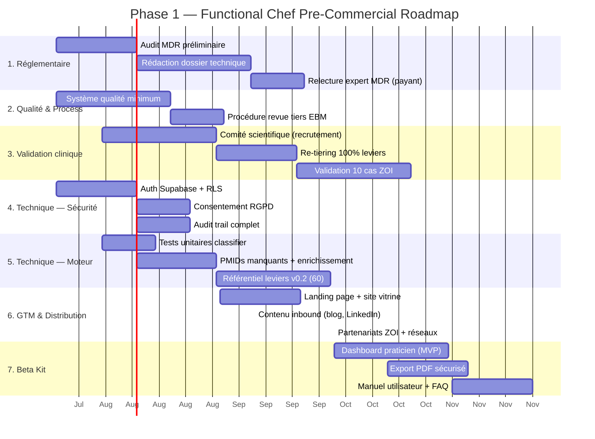

# Phase 1 — Pré-commercialisation (Objectif : J-90 à J+180)

> **Statut** : Plan de travail — Mis à jour avec l'analyse de marché (juillet 2026)
> **Version** : 1.1
> **Objectif** : Atteindre un niveau de maturité réglementaire, clinique et technique suffisant pour ouvrir une beta clinique contrôlée (Phase 2), sans exposition juridique ou réputationnelle.

---

## ✅ Validation de marché — Contexte

L'étude de marché a confirmé :
- **Océan bleu** : aucun concurrent direct n'offre un moteur AI de prescription culinaire EBM-tiered en B2B pour médecins
- **Demande validée** : Function Health ($350M, $2.5B valorisation), Zoe (100K+ abonnés à $348/an), Nourish (licorne $1B)
- **Marché** : $16B nutrition digitale, croissance 12% CAGR
- **Risque principal** : core audience IFM-certifié petit (~3 000 US) → stratégie multicanale obligatoire

**Conséquence roadmap** : la Phase 1 intègre désormais un workstream **GTM + Distribution** et priorise un **pilot français** (réseau ZOI existant, coût d'acquisition plus bas).

---

## Vue d'ensemble

---

## 1. Réglementaire — Qualification MDR

### Objectif
Déterminer la classe MDR exacte, rédiger le dossier technique, et établir la relation avec un organisme notifié.

### J1-J21 — Audit MDR préliminaire

| Livrable | Description | Format | Critère d'acceptation | Priorité |
|----------|-------------|--------|----------------------|----------|
| **LIV-01** | Rapport d'audit MDR préliminaire | PDF (<20 pages) | Classification confirmée (I, IIa, ou IIb) + checklist des exigences applicables | 🔴 Critique |
| **LIV-02** | Matrice d'écart MDR (« gap analysis ») | Tableur ou Markdown | Chaque annexe MDR listée avec statut : ✅ conforme / 🔶 partiel / ❌ manquant | 🔴 Critique |
| **LIV-03** | Note de positionnement « DM ou non DM » | PDF (<5 pages) | Argumentaire juridique justifiant la classification retenue | 🔴 Critique |

**Note** : ces 3 livrables peuvent être rédigés par IA (moi) et soumis à un expert MDR pour relecture-signature (1 500-3 000 € au lieu de 5-8k€).

### J22-J51 — Rédaction dossier technique

| Livrable | Description | Format | Critère d'acceptation | Priorité |
|----------|-------------|--------|----------------------|----------|
| **LIV-04** | Description du logiciel (functional intent, architecture, déploiement) | Doc technique | Approuvé par expert MDR | 🔴 Critique |
| **LIV-05** | Spécification des exigences (user needs + medical intent) | Tableau tracé | Chaque exigence tracée à un test de vérification | 🔴 Critique |
| **LIV-06** | Analyse des risques (ISO 14971) — rédaction IA + validation expert | FMEA tableur | Au minimum : 30 scénarios de risque identifiés, évalués, mitigés | 🔴 Critique |
| **LIV-07** | Plan de vérification et validation | Doc technique | Tests fonctionnels + tests cliniques | 🟡 Important |
| **LIV-08** | Gestion des données (data flow + sécurité) | Diagramme + doc | Flux de données patient tracé, mesures techniques listées | 🟡 Important |

### J52-J65 — Organisme notifié

| Livrable | Description | Format | Critère d'acceptation | Priorité |
|----------|-------------|--------|----------------------|----------|
| **LIV-09** | Pré-soumission à organisme notifié choisi | Dossier complet | Retour écrit de l'ON (acceptation / modifications requises / rejet) | 🔴 Critique |
| **LIV-10** | Plan de certification (échéancier, coût, jalons) | Document signé | Planning 12-18 mois post-phase 1 | 🟡 Important |

---

## 2. Qualité & Process — Système qualité minimal

### Objectif
Mettre en place le squelette ISO 13485 adapté à un logiciel de santé (taille startup, pas d'usine).

### J1-J30 — Mise en place

| Livrable | Description | Format | Critère d'acceptation | Priorité |
|----------|-------------|--------|----------------------|----------|
| **LIV-11** | Manuel qualité v1.0 (politique qualité, périmètre, responsabilités) | PDF signé | Revue par un consultant qualité | 🟡 Important |
| **LIV-12** | Procédure de maîtrise des documents (création, revue, approbation, archivage) | Document contrôlé | Applicable au repo GitHub (PRs, approvals, tags) | 🟡 Important |
| **LIV-13** | Procédure de gestion des non-conformités (signalement, analyse, CAPA) | Document contrôlé | Template CAPA prêt à l'emploi | 🟡 Important |
| **LIV-14** | Registre des modifications logicielles (lié au git log) | Script CI/CD | Automatiquement mis à jour à chaque release | 🟢 Nice-to-have |

### J31-J44 — Procédure revue des tiers EBM

| Livrable | Description | Format | Critère d'acceptation | Priorité |
|----------|-------------|--------|----------------------|----------|
| **LIV-15** | Procédure d'ajout / modification d'un levier culinaire | Document contrôlé | Tout changement de tier passe par : rédaction → revue par ≥1 médecin CS → validation → déploiement | 🟡 Important |
| **LIV-16** | Template de fiche de revue de levier | Formulaire PDF | Champs : PMID, tier proposé, tier validé, reviewer, date, réévaluation | 🟡 Important |
| **LIV-17** | Changelog EBM (traçabilité de chaque modification de tier) | Fichier Markdown dans le repo | Historique complet des tiers depuis v0.1 | 🟢 Nice-to-have |

---

## 3. Validation clinique — Crédibilité scientifique externe

### Objectif
Passer de « tiers auto-déclarés » à « tiers validés par un comité scientifique », et produire une première évidence clinique sur cas réels.

### J12-J41 — Recrutement comité scientifique

| Livrable | Description | Format | Critère d'acceptation | Priorité |
|----------|-------------|--------|----------------------|----------|
| **LIV-18** | Charte du comité scientifique (mission, membres, fréquence, rémunération) | PDF signé | ≥1 médecin nutritionnel + ≥1 chercheur en métabolisme | 🔴 Critique |
| **LIV-19** | Convention de collaboration (propriété intellectuelle, confidentialité) | Contrat signé | Protège la PI du projet, pas de conflit d'intérêts | 🔴 Critique |
| **LIV-20** | Comité constitué (min 2 membres) — CV + déclaration d'intérêts | Dossier RH | Vérification des références | 🔴 Critique |

### J42-J62 — Re-tiering complet (100% des leviers)

| Livrable | Description | Format | Critère d'acceptation | Priorité |
|----------|-------------|--------|----------------------|----------|
| **LIV-21** | Re-tiering de chaque levier existant par le CS | Fiches de revue (LIV-16) remplies | Chaque levier a au moins une signature CS | 🔴 Critique |
| **LIV-22** | Rapport de re-tiering : synthèse des modifications | PDF | Tiers modifiés listés avec justification | 🟡 Important |
| **LIV-23** | Publication du tiers validé dans la base (mise à jour `culinary_levers.ebm_tier`) | Seed SQL + migration | Traçable dans le changelog EBM (LIV-17) | 🟡 Important |

### J63-J92 — Validation sur 10 cas ZOI réels

| Livrable | Description | Format | Critère d'acceptation | Priorité |
|----------|-------------|--------|----------------------|----------|
| **LIV-24** | Protocole de validation (critères d'inclusion, endpoints, méthode) | Document contrôlé | Approuvé par le CS | 🔴 Critique |
| **LIV-25** | 10 cas cliniques réels anonymisés (ZOI ou patients du CS) | Tableau anonymisé | Pas de PHI, format structuré (json + PDF) | 🔴 Critique |
| **LIV-26** | Rapport de validation : résultats du moteur vs jugement clinique pour chaque cas | PDF | Concordance classifier vs médecin documentée pour chaque cas | 🔴 Critique |
| **LIV-27** | Matrice de concordance : sensibilité, spécificité, VPP, VPN par bottleneck | Tableau | Publiable (même en interne) | 🟡 Important |

---

## 4. Technique — Sécurité & Conformité RGPD

### Objectif
Rendre l'application capable de recevoir des données réelles de patients sans exposition.

### J1-J21 — Auth + RLS Supabase

| Livrable | Description | Format | Critère d'acceptation | Priorité |
|----------|-------------|--------|----------------------|----------|
| **LIV-28** | Module d'authentification Supabase (email+password, magic link, Google SSO) | Code + déploiement | Inscription, connexion, déconnexion, reset password | 🔴 Critique |
| **LIV-29** | RLS policies sur toutes les tables de données patient | Code SQL | Un praticien ne voit que ses patients ; un patient ne voit que ses consultations | 🔴 Critique |
| **LIV-30** | Table `professional_profiles` (nom, N° RPPS, spécialité, email vérifié) | Migration SQL + UI | Champs obligatoires pour usage B2B | 🔴 Critique |
| **LIV-31** | Table `patient_profiles` rattachée au professionnel | Migration SQL + UI | Relation N:1 praticien→patients | 🔴 Critique |

### J22-J35 — Consentement & Politique données

| Livrable | Description | Format | Critère d'acceptation | Priorité |
|----------|-------------|--------|----------------------|----------|
| **LIV-32** | Écran de consentement explicite (opt-in) avant première utilisation patient | Composant React | Horodaté + version de la politique + signature électronique | 🔴 Critique |
| **LIV-33** | Politique de confidentialité (RGPD Article 13) — rédaction IA + relecture avocat | Page web + PDF | Finalisée et relue par avocat (1 000-2 000 €) | 🔴 Critique |
| **LIV-34** | Politique de rétention des données (combien de temps, purge automatique) | Document + script cron | Cron de purge implémenté | 🟡 Important |
| **LIV-35** | Mécanisme de droit à l'oubli (suppression compte + données associées) | Code + vérification | Testé : suppression cascade via Supabase | 🔴 Critique |

### J22-J35 — Audit trail

| Livrable | Description | Format | Critère d'acceptation | Priorité |
|----------|-------------|--------|----------------------|----------|
| **LIV-36** | Table `audit_log` (qui, quoi, quand, quelle donnée, version du moteur) | Migration SQL + code | Chaque appel API `classify`/`compose` est loggé | 🔴 Critique |
| **LIV-37** | Interface de consultation de l'audit trail pour le praticien | UI paginée | Filtrable par patient, date, action | 🟡 Important |
| **LIV-38** | Export d'une consultation complète pour le dossier médical (traçabilité médico-légale) | PDF + JSON | Horodaté, signé, avec version du moteur | 🟡 Important |

---

## 5. Technique — Moteur & Référentiel

### Objectif
Consolider la fiabilité du moteur et étendre le référentiel pour tenir la promesse v0.2.

### J1-J14 — Tests unitaires du classifier

| Livrable | Description | Format | Critère d'acceptation | Priorité |
|----------|-------------|--------|----------------------|----------|
| **LIV-39** | Suite de tests unitaires pour `bottleneck-classifier.ts` | Fichier `__tests__/bottleneck-classifier.test.ts` | ≥10 cas : 3 cas-pivot (A/B/C) + 1 cas triple déclenché + 1 cas aucun + 1 cas valeurs limites + 1 cas hepatic_masld + 1 cas Bristol anormal + 1 cas catégoriel SIBO | 🔴 Critique |
| **LIV-40** | Tests unitaires pour `safety-filters.ts` | Fichier `__tests__/safety-filters.test.ts` | Chaque condition médicale testée (≥9 cas) | 🔴 Critique |
| **LIV-41** | Tests unitaires pour `lever-selector.ts` | Fichier `__tests__/lever-selector.test.ts` | Cas : dominance unique, co-dominance, hepatic_masld, pas assez de stars | 🔴 Critique |
| **LIV-42** | Script `npm run test` qui lance toute la suite | package.json | `npm test` → exit 0 | 🔴 Critique |
| **LIV-43** | CI GitHub Actions qui exécute les tests sur chaque PR push | `.github/workflows/test.yml` | Testé sur push et PR | 🔴 Critique |

### J10-J30 — PMIDs manquants + correctifs

| Livrable | Description | Format | Critère d'acceptation | Priorité |
|----------|-------------|--------|----------------------|----------|
| **LIV-44** | PMID confirmé pour `L_REDUCE_FREE_SUGAR_10PCT` | Recherche + mise à jour seed | PMID réel, vérifié | 🔴 Critique |
| **LIV-45** | Revue de tous les PMIDs existants (vérification qu'ils pointent bien vers la bonne publication) | Tableau de vérification | 100% des PMIDs testés manuellement | 🔴 Critique |
| **LIV-46** | Mise à jour des seeds avec PMIDs supplémentaires (min 5 nouveaux) | Seed SQL | PMIDs ajoutés pour les leviers qui n'en avaient qu'un | 🟡 Important |

### J21-J51 — Référentiel v0.2 (60 leviers)

| Livrable | Description | Format | Critère d'acceptation | Priorité |
|----------|-------------|--------|----------------------|----------|
| **LIV-47** | Catalogue des 35 nouveaux leviers ciblés (doc de spécification avant implémentation) | Markdown | Chaque levier : catégorie, mécanisme, tier proposé, 1 reference pivot, contre-indications | 🟡 Important |
| **LIV-48** | Nouveaux seeds SQL (35 leviers) + mapping + thresholds | SQL | Validation syntaxique + intégrité référentielle | 🟡 Important |
| **LIV-49** | Nouveaux tiers validés par le comité scientifique | Fiches LIV-16 | Applicable si le CS est déjà constitué | 🟢 Nice-to-have |

---

## 6. GTM & Distribution — Aller au marché

### Objectif
Préparer le terrain commercial pour un lancement beta en France, avec une stratégie de contenu et des partenariats.

### J43-J63 — Landing page + site vitrine

| Livrable | Description | Format | Critère d'acceptation | Priorité |
|----------|-------------|--------|----------------------|----------|
| **LIV-50** | Landing page Functional Chef (valeur ajoutée, EBM, CTA "Beta Praticien") | Page Next.js déployée (Vercel) | Design propre, responsive, pas de PHI, pas de claim médical non sourcé | 🟡 Important |
| **LIV-51** | Formulaire de pré-inscription beta praticiens (email, spécialité, volume patients) | Composant React + Supabase | Données collectées dans une table sécurisée | 🟡 Important |
| **LIV-52** | Page de démonstration interactive (simulation du moteur sans auth — cas A/B/C préchargés) | Page Next.js | Un médecin peut tester le classifier sans créer de compte | 🟡 Important |
| **LIV-53** | Blog Functional Chef (1-2 articles fondateurs : philosophie, EBM tiering, les 3 bottlenecks) | Notion ou site statique | Publié + linké dans la landing page | 🟢 Nice-to-have |

### J50-JX — Contenu inbound

| Livrable | Description | Format | Critère d'acceptation | Priorité |
|----------|-------------|--------|----------------------|----------|
| **LIV-54** | Fil LinkedIn (posts techniques pour praticiens : cas cliniques, tiers EBM, mécanismes) | LinkedIn posts | 2-3 posts/semaine ciblant les hashtags #MédecineFonctionnelle #Nutrition #EBM | 🟡 Important |
| **LIV-55** | Article guest : « Pourquoi la prescription nutritionnelle a besoin d'EBM tiering » | Medium / LinkedIn Article | Publié, partagé dans les groupes FM | 🟢 Nice-to-have |
| **LIV-56** | Collection de cas cliniques anonymisés (1 cas/levier, avec tiering et sortie moteur) | Blog posts | 1 post/15j | 🟢 Nice-to-have |

### J60-JX — Partenariats & Réseaux

| Livrable | Description | Format | Critère d'acceptation | Priorité |
|----------|-------------|--------|----------------------|----------|
| **LIV-57** | Proposition de partenariat ZOI Analyse Patient (intégration sortie nutritionnelle) | Document PDF <10 pages | Envoyé + suivi | 🔴 Critique |
| **LIV-58** | Contact des 5 premiers praticiens early adopters (réseau personnel Rafik + ZOI) | Email + call de démo | 5 inscrits à la beta | 🔴 Critique |
| **LIV-59** | Message dans les groupes Telegram/WhatsApp de médecine fonctionnelle FR | Message ciblé | Pas de spam, approche éditoriale | 🟡 Important |

---

## 7. Beta Kit — Préparation au pilote

### Objectif
Produire les artefacts nécessaires pour ouvrir un pilote clinique contrôlé de 20 patients.

### J73-J102 — Dashboard praticien (MVP)

| Livrable | Description | Format | Critère d'acceptation | Priorité |
|----------|-------------|--------|----------------------|----------|
| **LIV-60** | Liste des consultations par patient (date, bottleneck, statut) | Composant React | Paginée, filtrable | 🔴 Critique |
| **LIV-61** | Consultation détaillée (input → classification → leviers → plat) | Composant React | Vue lecture seule complète | 🔴 Critique |
| **LIV-62** | Validation médecin (bouton « Valider » qui horodate la validation + signe) | Composant React + DB | Audit trail mis à jour | 🔴 Critique |
| **LIV-63** | Compteur d'utilisation (nb consultations/mois, nb patients, leviers les plus utilisés) | Composant React | Stats agrégées par praticien | 🟡 Important |

### J88-J108 — Export PDF sécurisé

| Livrable | Description | Format | Critère d'acceptation | Priorité |
|----------|-------------|--------|----------------------|----------|
| **LIV-64** | Générateur PDF de la consultation patient | Composant React (PDF) ou API | Titre, classification, leviers, plat, effets attendus, warnings, signature médecin | 🟡 Important |
| **LIV-65** | PDF signé électroniquement (horodatage + empreinte) | Fichier PDF | Vérifiable (hash SHA256 stocké en base) | 🟡 Important |
| **LIV-66** | Téléchargement PDF depuis la consultation | Bouton UI | Fonctionne en desktop et mobile | 🟡 Important |

### J103-J123 — Manuel & FAQ

| Livrable | Description | Format | Critère d'acceptation | Priorité |
|----------|-------------|--------|----------------------|----------|
| **LIV-67** | Guide d'utilisation pour le praticien (prise en main, cas d'usage, limites) | PDF (<15 pages) | Relu par 1 early adopter | 🟡 Important |
| **LIV-68** | FAQ juridique et médicale (responsabilité, confidentialité, MDR, RGPD) | Page web + PDF | Relue par avocat + comité scientifique | 🟡 Important |
| **LIV-69** | Note d'information patient (ce que fait Functional Chef, ce qu'il ne fait pas, consentement) | Page web + PDF imprimable | Niveau de lecture Flesch ≥60 | 🔴 Critique |

---

## Budget révisé Phase 1

| Poste | Estimation initiale | Estimation révisée (rédaction IA + relecture humaine) | Économie |
|-------|-------------------|-----------------------------------------------------|----------|
| Consultant réglementaire MDR | 5 000 - 8 000 € | **1 500 - 3 000 €** (relecture + signature) | ~60% |
| Consultant qualité ISO 13485 | 3 000 - 5 000 € | **1 000 - 2 000 €** (relecture procédures) | ~60% |
| Avocat RGPD + contrats | 2 000 - 4 000 € | **1 000 - 2 000 €** (relecture politique) | ~50% |
| Comité scientifique (2 médecins) | 3 000 - 5 000 € | **2 000 - 3 000 €** (invariant — signature requise) | ~30% |
| Développement (auth, RLS, tests, PDF) | Temps dev (4-6 sem) | **Temps dev (moi)** — 0 € | 100% |
| Assurance RC Pro + Cyber | 1 500 - 3 000 €/an | **1 500 - 3 000 €/an** (invariant) | 0% |
| **Total Phase 1** | **15 000 - 25 000 €** | **~7 000 - 13 000 €** | **~50%** |

---

## Critères de passage en Phase 2

Avant d'ouvrir la beta clinique (Phase 2 — 20 patients), ces **checkpoints obligatoires** doivent être ✅ :

- [ ] **LIV-03** : Classification MDR claire + note juridique favorable
- [ ] **LIV-06** : Analyse des risques complète (≥30 scénarios)
- [ ] **LIV-16** : Procédure de revue EBM appliquée à 100% des leviers
- [ ] **LIV-24** : Protocole de validation clinique approuvé par le CS
- [ ] **LIV-29** : RLS Supabase activées et testées (test d'intrusion basique)
- [ ] **LIV-33** : Politique de confidentialité publiée
- [ ] **LIV-36** : Audit trail opérationnel
- [ ] **LIV-43** : CI tests automatisés en place
- [ ] **LIV-62** : Validation médecin implémentée
- [ ] **LIV-68** : FAQ juridique publiée
- [ ] **Assurance RC Pro + Cyber** souscrite
- [ ] **LIV-51** : ≥5 praticiens pré-inscrits à la beta

---

## Glossaire des abréviations

| Abréviation | Signification |
|-------------|---------------|
| MDR | Medical Device Regulation (UE 2017/745) |
| DM | Dispositif Médical |
| ON | Organisme Notifié |
| RLS | Row-Level Security (Supabase) |
| CS | Comité Scientifique |
| CAPA | Corrective And Preventive Action |
| FMEA | Failure Mode and Effects Analysis |
| PHI | Protected Health Information |
| RPPS | Répertoire Partagé des Professionnels de Santé |
| VPP/VPN | Valeur Prédictive Positive / Négative |
| ZOI | Zone d'Intérêt |
| GTM | Go-To-Market |
| ARR | Annual Recurring Revenue |
| TAM | Total Addressable Market |

---

> **Prochaine étape suggérée** : attaquer le workstream **5. Technique — Moteur** (tests + PMIDs) — 100% IA, 0€, valeur immédiate. Parallèlement, rédiger les livrables réglementaires (workstream 1) pour soumission à un expert MDR en relecture seulement.
